# 🚍  버스 어디? BUDDY 🚍

 실시간 셔틀버스 위치 공유 서비스

## 0. 프로젝트 개요
###  삼성 청년 SW 아카데미 11th 공통프로젝트 우수상 🏆
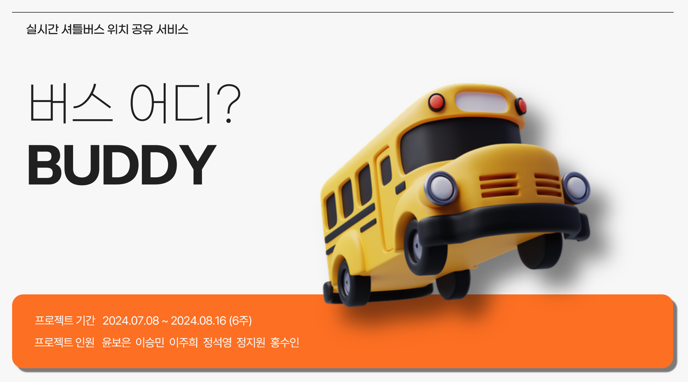 

### **📆 프로젝트** 기간
2024.07.08 ~ 2024.08.16 (6주)

### **💭** 기획 배경

**[문제점 분석]**

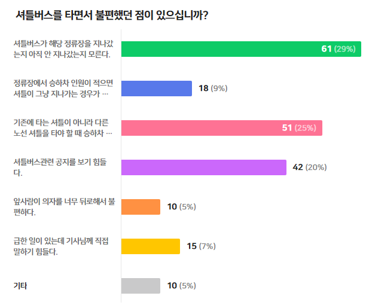 

설문조사 결과, 대부분의 교육생이 셔틀버스 이용에 불편을 겪은 경험이 있다고 응답

주요 문제점
1. 실시간 셔틀버스 위치를 모름
2. 정류장 위치 등 관련 정보를 보기 어려움
3. 관련 공지사항을 찾기 어려움

솔루션
: 하나의 앱에서 셔틀버스 위치 정보 공유, 공지사항 알림, 커뮤니티 공간을 제공함으로써 정보 부족 문제 해결

## 1. 기능 소개
### ❔ 소개페이지
 

사용자가 어플리케이션의 주요기능을 한눈에 볼 수 있도록 소개페이지 구성

### 🤍 회원가입 
   

[1차 인증] AI(YOLO)를 활용하여 학생증으로 SSAFY 교육생 여부를 판정

[2차 인증] MatterMost Incoming Webhook으로 발송한 랜덤코드로 인증 후 회원가입

### 💚 로그인 

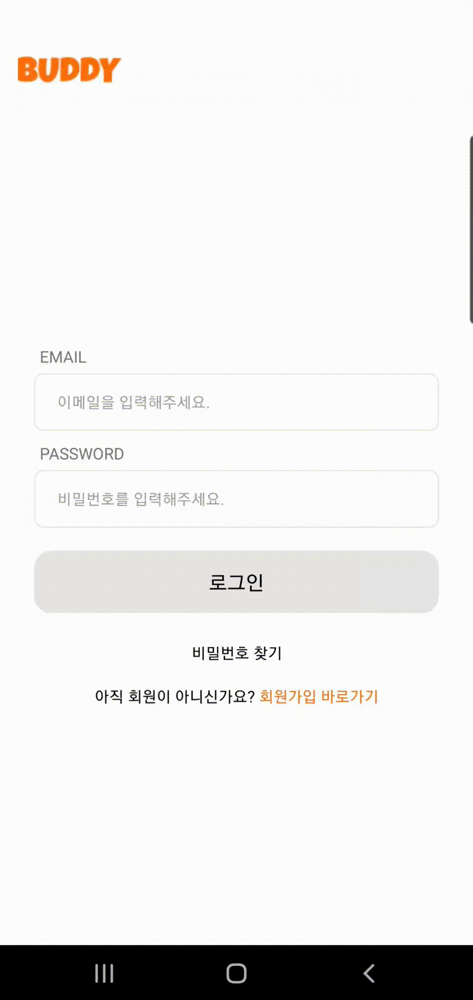 

  JWT 기반 Spring Security
  
  일반 로그인(이메일, 비밀번호)

### 🚍 버스 위치 정보
 

#### 버스의 실시간 위치 제공
- 기사님 핸드폰 GPS를 이용하여 해당 셔틀버스의 실시간 위치 정보 공유
- 즐겨찾기 정류장 전 정류장 도착 시 푸쉬 알림 & TTS 알림 전송 ( 예 : “🚌 버스가 곧 즐겨찾기 정류장에 도착합니다. 현재위치 : 갈마역”)

#### 버스의 예상 도착 시간 제공
- 외부 API를 이용하여 예상 도착 시간 제공
- 지도 API를 사용하여 실시간 교통 정보를 수집하고, AI 모델을 통해 예상 도착 시간을 계산
- 날씨, 도로 공사, 교통 체증 등 변수 반영하여 제공

#### Kafka를 통하여 실시간 버스의 위치 안정적으로 받아오기 
  - 각 버스의 호차마다 Topic을 지정하여 독립적인 데이터를 처리
  - 토픽별 파티션을 3개씩 부여하여 병렬처리
  
### 📈 정보 제공

#### 셔틀버스 노선도 제공
- 호차 별 셔틀버스 노선 지도에 표시하여 시각화
- 호차 별 정류장 정보 표시

### 💬 게시판 기능
 

공지사항, 게시판 커뮤니티 공간 제공

### 🔊 푸시 알림
 

#### 즐겨찾기 정류장의 직전 정류장 도착 시 푸시 알림
- 데이터베이스에 사용자 즐겨찾기 정류장 GPS 좌표 저장
- 사용자 실시간 위치를 백그라운드 위치 추적 및 주기적 업데이트
- 사용자 현재 위치와 즐겨찾기 정류장 간 거리 계산하여 일정 반경 내 접근 시 푸시 알림 전송

#### 공지사항 등록 시 푸시 알림
- 관리자가 공지사항을 등록할 경우 사용자에게 푸시 알림 전송
- 셔틀 버스 탑승한 사용자가 건의하기 클릭 시 해당 호차 관리자 계정에 푸시 알림 전송 및 TTS 알림

### 🗣️ 기사님과의 소통

  

#### 비상 연락 시스템
- 긴급 상황시 기사님에게 건의사항 전송
- ex) 급히 화장실 가야 해서 멈춰 달라고 해야할 때
- 건의하기 전송 시 관리자에게 푸시 알림 및 TTS 알림

### 🎫 QR 체크인

 

- 탑승인원 파악 (전 호차 실시간 탑승인원 표시)
- 입장 시 익명 채팅창 활성화(익명 실시간 건의 및 소통, 알림표시?만)
- 입장 시 해당 호차 기사님과 소통할 수 있는 건의하기 페이지 활성화
- 버스 탑승 인원 정보 제공

## 2. 화면 구성

### 👁‍🗨 와이어 프레임

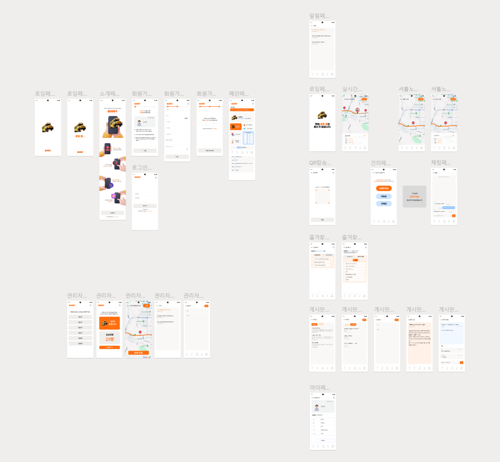 

### API 명세서
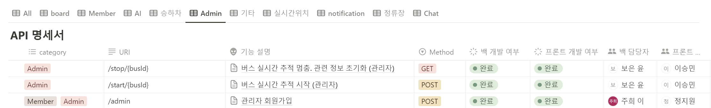 
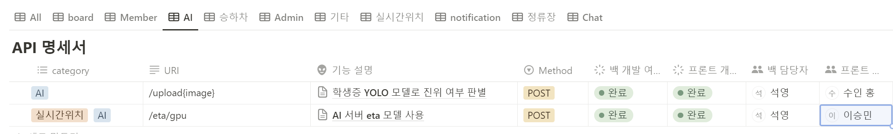 
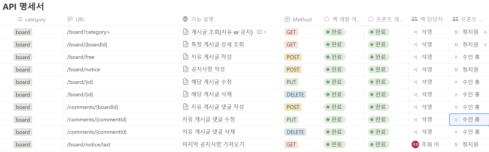 
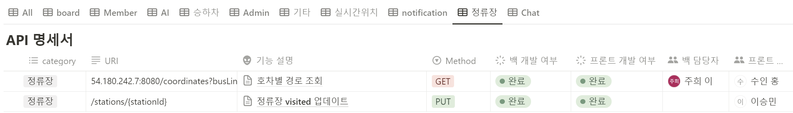 
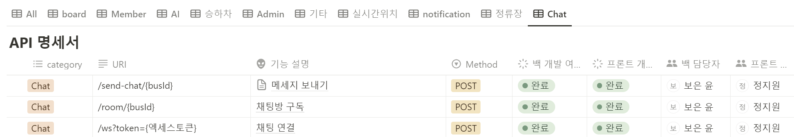 
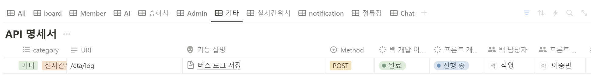 
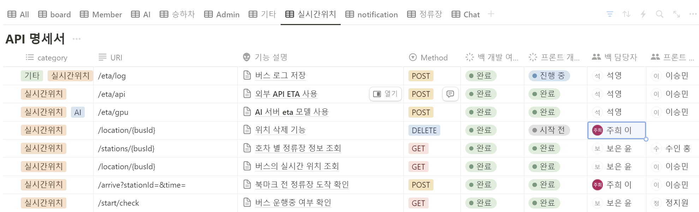 
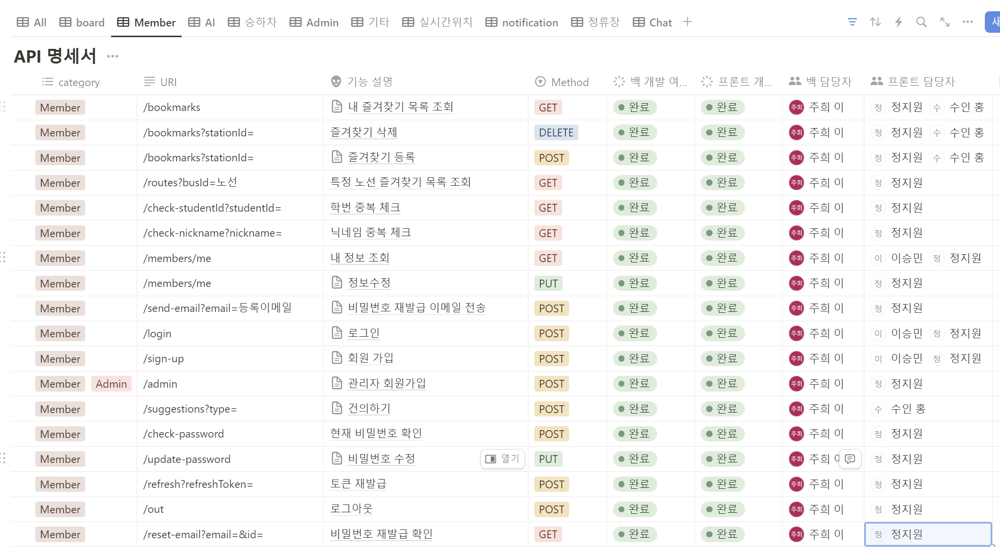 
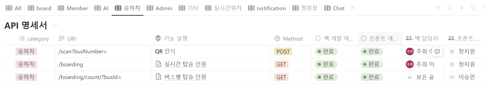 

###  프로젝트 구조
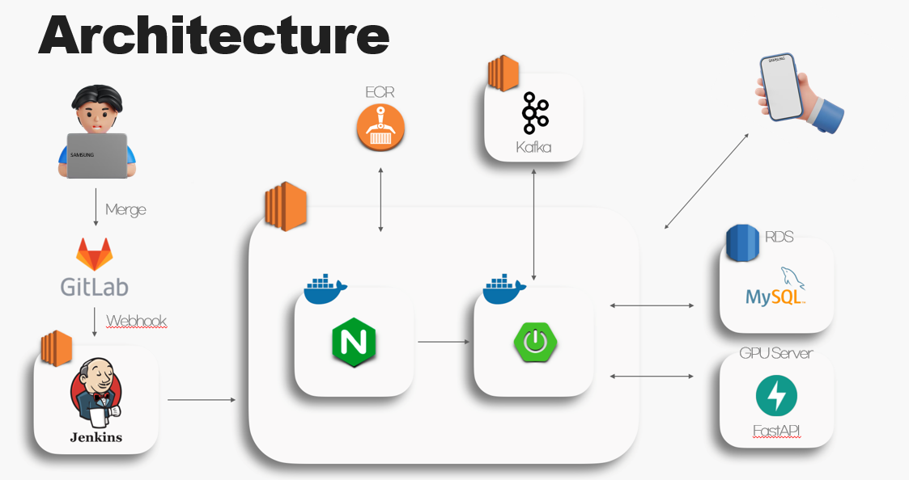 
## 3. 기대 효과

- 전국 SSAFY 캠퍼스로 확장 가능

- 셔틀버스를 운행하는 기업으로의 B2B 서비스로 확장

### 👯 팀 구성

<table>
<tr>
    <td align="center"><a href="https://github.com/boeunyoon"><b>👑윤보은</b></a></td>
    <td align="center"><a href="https://github.com/seungminleeee"><b>이승민</b></a></td>
    <td align="center"><a href="https://github.com/zhzzang"><b>이주희</b></a></td>
    <td align="center"><a href="https://github.com/aswe0409"><b>정석영</b></a></td>
    <td align="center"><a href="https://github.com/stopvvon"><b>정지원</b></a></td>
    <td align="center"><a href="https://github.com/ssuinh"><b>홍수인</b></a></td>
  </tr>
 <tr>
    <td align="center"></td>
    <td align="center"></td>
    <td align="center"></td>
    <td align="center"></td>
    <td align="center"></td>
   <td align="center"></td>
  </tr>
  <tr>
    <td align="center"><b>FE & BE</b></a></td>
    <td align="center"><b>FE</b></a></td>
    <td align="center"><b>BE & Infra</b></a></td>
    <td align="center"><b>BE & AI</b></a></td>
    <td align="center"><b>FE</b></a></td>
    <td align="center"><b>FE</b></a></td>
  </tr>
</table>

### **💻 기술 스택**

**FE Development**

      

**BE Development**

     

**Database**

   

**AI**

  

**Infra**

   

**SUPPORT TOOL**

        

**CI/CD**

  
